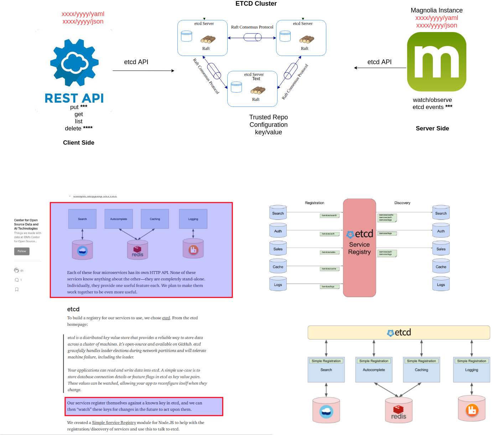

# Server side for books store: 




**Watcher/Observer etcd events for spring books store:** 

It uses the implementation `com.ibm.etcd:etcd-java:0.0.16` library:

- https://github.com/IBM/etcd-java
  
in order to interact with `etcd` cluster, but can be used the `coreOS` library too:

- https://github.com/etcd-io/jetcd, it is:

```
<dependency>
    <groupId>com.coreos</groupId>
    <artifactId>jetcd-core</artifactId>
    <version>${jetcd.version}</version>
</dependency>
```

It was just to check both...some examples to interact with `etcd` cluster are here:

- https://github.com/etcd-io/jetcd/tree/master/jetcd-examples


# Client side for books store

The repo for the client side is:

- https://github.com/indrabasak/spring-etcd-example (**Client Side endpoints - Rest API**)


## Note: 

To setup a `etcd cluster` for local development just do:

Create `docker compose` file
```
version: "3"

services:
    etcd:
        image: gcr.io/etcd-development/etcd:v3.4.13
        command: >
            /usr/local/bin/etcd
            --name node1
            --initial-advertise-peer-urls http://127.0.0.1:2380
            --listen-peer-urls http://0.0.0.0:2380
            --advertise-client-urls http://127.0.0.1:2379
            --listen-client-urls http://0.0.0.0:2379
            --initial-cluster node1=http://127.0.0.1:2380
            --debug
        expose:
            - 2379
            - 2380
        ports:
            - "2379:2379"
            - "3380:2380"
```

Run it

```
docker-compose up -d
```


### References

- https://etcd.io/docs/v3.4.0/dev-guide/interacting_v3/#find-versions
- https://github.com/etcd-io/etcd/issues/5399
- https://github.com/swingbach/etcd/commit/f3e54459883edc964831920079c8ed093ca1ab3f
- https://medium.com/codait/simple-service-registry-4550aee5a869
- https://malike.github.io/Configuration-Management-For-Microservices-And-Distributed-Systems.html
- https://www.youtube.com/watch?v=UyvI4BXO2DE&t=201s&ab_channel=Payara
- https://www.compose.com/databases/etcd
- https://etcd.io/docs/v3.3.12/learning/why/
- https://hackernoon.com/setting-up-an-etcd-cluster-on-aws-using-coreos-terraform-bc7ad7e8175b
- https://aws.amazon.com/marketplace/pp/Bitnami-etcd-Container-Solution/B07KCRBNWC#pdp-reviews


